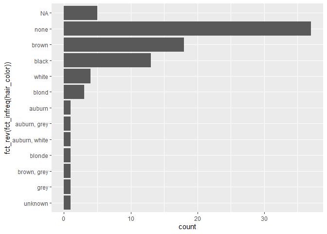
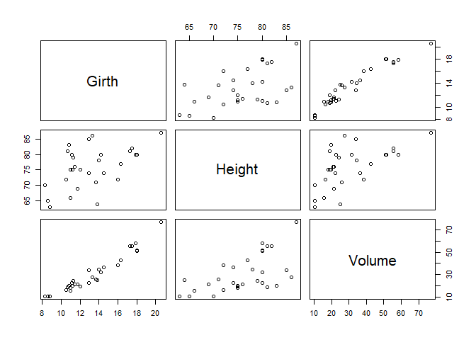

Externalization - example 1
================

Pull in external scripts into existing code chunks

from:
<https://stackoverflow.com/questions/14796501/is-it-possible-to-call-external-r-script-from-r-markdown-rmd-in-rstudio>

## Load Libraries

    ## -- Attaching packages ----------------------------------------------- tidyverse 1.2.1 --

    ## v ggplot2 3.2.1     v purrr   0.3.3
    ## v tibble  2.1.3     v dplyr   0.8.3
    ## v tidyr   1.0.0     v stringr 1.4.0
    ## v readr   1.3.1     v forcats 0.4.0

    ## -- Conflicts -------------------------------------------------- tidyverse_conflicts() --
    ## x dplyr::filter() masks stats::filter()
    ## x dplyr::lag()    masks stats::lag()

## Load Data

## Display Data

    ## # A tibble: 87 x 13
    ##    name  height  mass hair_color skin_color eye_color birth_year gender
    ##    <chr>  <int> <dbl> <chr>      <chr>      <chr>          <dbl> <chr> 
    ##  1 Luke~    172    77 blond      fair       blue            19   male  
    ##  2 C-3PO    167    75 <NA>       gold       yellow         112   <NA>  
    ##  3 R2-D2     96    32 <NA>       white, bl~ red             33   <NA>  
    ##  4 Dart~    202   136 none       white      yellow          41.9 male  
    ##  5 Leia~    150    49 brown      light      brown           19   female
    ##  6 Owen~    178   120 brown, gr~ light      blue            52   male  
    ##  7 Beru~    165    75 brown      light      blue            47   female
    ##  8 R5-D4     97    32 <NA>       white, red red             NA   <NA>  
    ##  9 Bigg~    183    84 black      light      brown           24   male  
    ## 10 Obi-~    182    77 auburn, w~ fair       blue-gray       57   male  
    ## # ... with 77 more rows, and 5 more variables: homeworld <chr>,
    ## #   species <chr>, films <list>, vehicles <list>, starships <list>

## Viz

<!-- -->

## Tree Plot

Let’s use some base R: plot the on-board `trees` dataset

<!-- -->

## Imaginary Thanksgiving Conversation

    ## [1] "Eisenhower" "Nixon"      "Ford"       "Reagan"     "Bush"      
    ## [6] "Bush"

TH: Do you know the names of the Republican presidents?

NP: No.

TH: Well you’ve got: **Eisenhower, Nixon, Ford, Reagan, Bush, Bush**.
That’s it.

NP: There are more. Right?

TH: I don’t wanna to talk any more.
