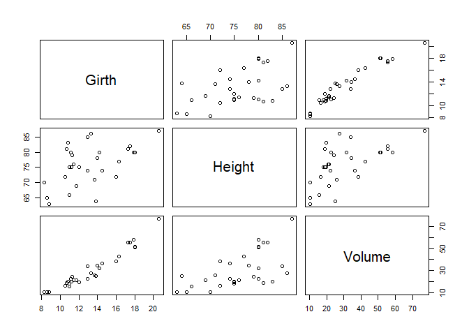

Externalization - example 1
================

**Externalization**: import in child scripts into existing parent code

I think this is easiest to learn from existing examples.

  - [Parent script](01.example.Rmd)
  - [Child script 1](src/example_starwars.R)
  - [Child script 2](src/example_trees.Rmd)
  - [Output – GitHub Markdown Document](01_example.md)
  - [Output – GitHub 01\_example.html](01_example.htmls)

## Background

While it is possible for a parent R Markdown document (.Rmd) to use
externalized code chunks from child R Markdown documents (also .Rmd).
The seemingly most logical approach is to have the child chuncks come
from standar .R scripts.

## Steps

1.  Have a parent .Rmd script (01\_example.Rmd)

2.  Have at least one child .R script (src/example\_starwars.R)

3.  In the parent script, use the `knitr::read_chunk` function to import
    code “chunks” from the child script.
    
      - each child “chunk” (subroutine) is delimited by a chunk name.
        That name is used in the parent code chunk
      - e.g. Child.R script contains label sub-routins: e.g. `## @knitr
        chunk_name` where `chunk_name` varies according to the
        sub-routine

## Load Libraries

1.  A separate chunk, in the Parent, can now call a sub-routine within
    the child script simply by using the child chunk “name” as the
    parent code chunk name.
    
      - Again, the child chunk name is in the child script, a label
        following the `@knitr` disgnation, following a `#` comment tag
        in the first postion of the line.
        
          - e.g. `# @knitr load_libraries`
    
      - Meanwhile, the parent code-chunk name is the name of the child
        code-chunk name
        
          - e.g. `{r load_libraries}`
          - of course, this is a standard code chund so the above is
            preceeded by three back ticks, and a following, closing,
            line of three back ticks. Just the way any R Markdown
            code-chunk appears.

<!-- end list -->

    ## -- Attaching packages ------------------------------------------------------------------------- tidyverse 1.2.1 --

    ## v ggplot2 3.2.1     v purrr   0.3.3
    ## v tibble  2.1.3     v dplyr   0.8.3
    ## v tidyr   1.0.0     v stringr 1.4.0
    ## v readr   1.3.1     v forcats 0.4.0

    ## -- Conflicts ---------------------------------------------------------------------------- tidyverse_conflicts() --
    ## x dplyr::filter() masks stats::filter()
    ## x dplyr::lag()    masks stats::lag()

## Load Data

## Display Data

    ## # A tibble: 87 x 13
    ##    name  height  mass hair_color skin_color eye_color birth_year gender
    ##    <chr>  <int> <dbl> <chr>      <chr>      <chr>          <dbl> <chr> 
    ##  1 Luke~    172    77 blond      fair       blue            19   male  
    ##  2 C-3PO    167    75 <NA>       gold       yellow         112   <NA>  
    ##  3 R2-D2     96    32 <NA>       white, bl~ red             33   <NA>  
    ##  4 Dart~    202   136 none       white      yellow          41.9 male  
    ##  5 Leia~    150    49 brown      light      brown           19   female
    ##  6 Owen~    178   120 brown, gr~ light      blue            52   male  
    ##  7 Beru~    165    75 brown      light      blue            47   female
    ##  8 R5-D4     97    32 <NA>       white, red red             NA   <NA>  
    ##  9 Bigg~    183    84 black      light      brown           24   male  
    ## 10 Obi-~    182    77 auburn, w~ fair       blue-gray       57   male  
    ## # ... with 77 more rows, and 5 more variables: homeworld <chr>,
    ## #   species <chr>, films <list>, vehicles <list>, starships <list>

## Viz

<!-- -->

## Tree Plot

Now there is this one problem that an R Markdown document can only use a
code-chunk name once in a document. But you can easily get around this
problem by using different parent code-chunk names, along with the
`child` argument in the code-chunk code header

``` 
- e.g.

    - `{r trees1,  child='src/example_trees.Rmd'}`
    - `{r trees2,  child='src/example_trees.Rmd'}`
    
```

These two examples actually do the same thing. But since there are
different code chunk names, they child code can be reused within the
parent document. The catch that I see here is that the child-chunk now
has to be a .Rmd file and can only have a single sub-routine
(code-chunk) within it.

Let’s use some base R: plot the on-board `trees` dataset

Trees example one

<!-- -->

Trees example two

<!-- -->

## Summary

There are at least two options. They work interchangebly

Optioin 1:

  - Store multiple sub-routines in a single .R script
    
      - each sub-routine name is a `#`comment, followed by `@kniter`,
        followed by the chunk name
      - In the parent file, there must be at least one parent code chunk
        with the `kinter::read_chunk()` function
      - This child chunk name becomes the chunk name for a code chunk in
        the parent .Rmd file

Option 2:

  - Store each sub-routine as a separate .Rmd file
    
      - The child sub-routine must be written inside a standard .Rmd
        code-chunk
      - The sub-routine is called in the parent .Rmd with the `child=`
        argument of the parent code-chunk header
      - This sub-routine can be reused within the parent document

## Fun Final Example

### Imaginary Thanksgiving Conversation

The next sub-routing is from the master child document
example\_starwars.R. The purpose is to create a vector from a tabular
dataset of presidential information.

    ## [1] "Eisenhower" "Nixon"      "Ford"       "Reagan"     "Bush"      
    ## [6] "Bush"

Now I’ll use that vector with inline code, below….

TH: Do you know the names of the Republican presidents?

NP: No.

TH: Well you’ve got: **r `repub_prezes_vector`**. That’s it.

NP: There are more. Right?

TH: I don’t wanna to talk any more.
